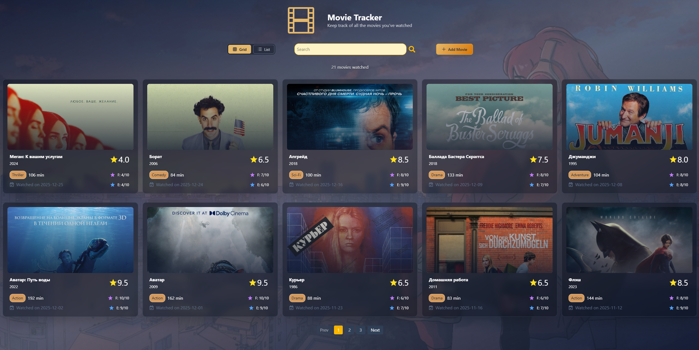
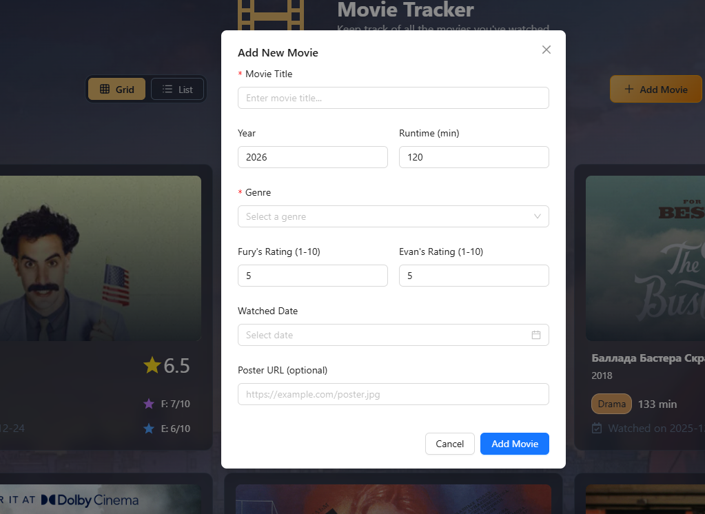

# flask_kino_tracker

Сайт для отслеживания просмотренных фильмов.

# Технологии

Используется Flask для работы с Mongodb, React js для фонтенда, Caddy и Docker для развертывания.

# Функционал

Были реализованы следующие фичи:

* Добавление фильма
* Отображение всех фильмов с сортировкой по дате просмотра
* Поиск фильма по названию
* Пагинация на бэкенде

# Итоговый вид

